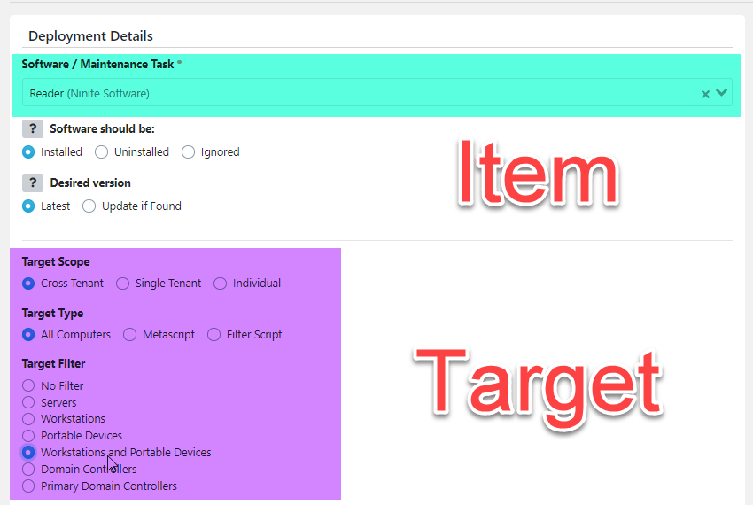
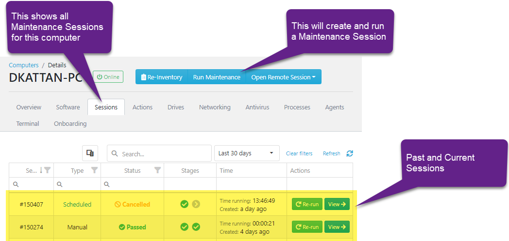
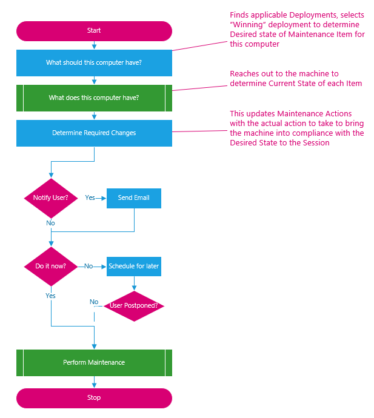
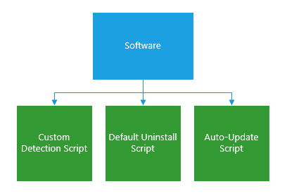
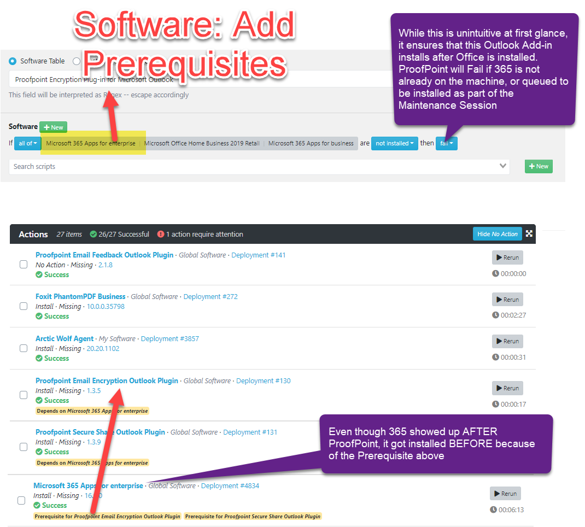
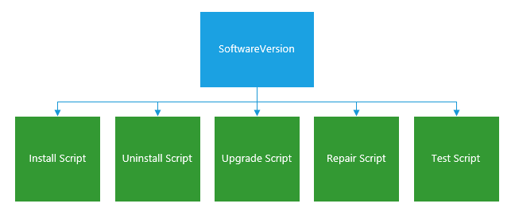
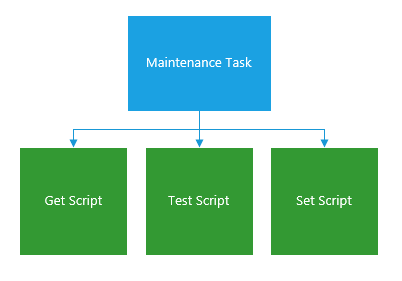
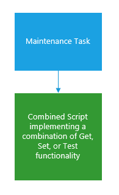

# Introduction

## Deployment (aka "TargetAssignment")

**Important**
If you are just getting into ImmyBot, making Deployments is where you should start.

A deployments is a rules that assigns Software or Maintenance Tasks (Collectively known as "Maintenance Items") to Targets.

Deployments are conceptually similar to Group Policies in that they assign settings to a group of users or computers.

DO NOT BE AFRAID TO SAVE YOUR DEPLOYMENTS, UNLIKE GROUP POLICY THEY DO NOT APPLY AUTOMATICALLY.

If you DO want your Deployments to be applied automatically, you need to create a Schedule.

### Target
A "Target" is a grouping of computers (or Tenants in the case of "Cloud Tasks")

Immybot's ability to resolve targets to a group of computers is perhaps the most powerful feature. 

For example, you can select a Group from AzureAD (which includes on-prem synced groups, and Teams) and ImmyBot will automatically resolve that to the list of computers in use by the people in that group.

If you enable PSA integration, ImmyBot a Target could be all computers covered under a certain type of Agreement, or computers covered any type of Agreement that includes a certain product.

## Maintenance Session

A Maintenance Session is conceptually similar to running gpupdate /force

In other systems, different types of maintenance happen on their own schedule. Windows Updates may run on Tuesday night, but Third Party updates may run on Wednesday night, and auto-fix tasks may run whenever an alert is fired for a failed monitor, which has its own polling interval. 

By forcing all automation to happen in a single, linear set of actions we call a Maintenance Session, we can deliver predictability not only as to _what_ changes will be made, but also _when_.

This also provides a cohesive mechanism for setting up a new computer. At best in traditional RMMs you can assign Monitors that detect the absence of required software and run Install scripts when they are missing, but this doesn't scale as pre-requisites and exclusions are required.

Imagine if Group Policy could reliably deploy any type of software, and gpupdate /force worked reliably off-net, and when you ran it, it gave you real-time immediate feedback about exactly what it was doing. Also imagine that it could optionally notify the end user before and after with a branded email telling them exactly what we are changing, that optionally lets them cancel.

That's a Maintenance Session.

You can view Maintenance Sessions for all computers under Computers-Sessions

Or, you can view Maintenance Sessions for a specific Computer under the Sessions tab for that Computer

## Maintenance Session Stages

### Detection Stage
During the Detection Stage, the Maintenance Session is populated with a list of Maintenance Actions.

This is a read-only process, and during this time (usually during the day) you can optionally have Immy send an email to the user letting them know that maintenance will be run later.

### Execution Stage

## Maintenance Action

A *Maintenance Session* has one or more *Maintenance Actions*. A Maintenance Action could be to install software, apply a Windows Update, or run a Maintenance Task. 

The image below depicts a typical Maintenance Session with many Maintenance Actions

## Software

### Pre-Requisities 
#### Install required dependencies

#### Ordering Maintenance Actions

### Detection Method
A Detection Method is required in order to know

## Software Version

## Maintenance Task

or

### Maintenance Task Modes

#### Enforce
Runs the "test" script, if the test returns false, runs "set", then runs "test" again to verify.

#### Audit
Runs the "test" script which should return true or false. It can output whatever it wants, but the last output should be boolean.

#### Monitor
Runs the "get" script, which can return anything. Useful for collecting data like Bitlocker Keys, Quickbooks Licenses, or any other piece of information you are interested in.

## Scripts
From the above diagrams, you can see that scripts are the building blocks for higher level objects in 

### Execution Context
#### System
Run as a service on the machine

#### User
Will attempt to run as the logged on user

#### Metascript
Runs in the ImmyBot backend, and can spawn code on the system by using Invoke-ImmyCommand 

## Schedules
Used to run maintenance periodically on machines. Can optionally be limited to a single Maintenance Item. NOTE You must also have a Deployment for the Maintenance Item!

## RMM Links

To ImmyBot an RMM is a system that provides a list of computers, and a mechanism to run PowerShell scripts on them.

To avoid having to deploy the ImmyAgent to existing machines, ImmyBot optionally integrates with RMMs like ConnectWise Automate and ConnectWise Control and uses their agents instead. These systems are not as performant as the ImmyAgent, but can suppliment ImmyBot functionality.  

For example, if you add an RMM Link for ConnectWise Control, you can open a remote session to the computer directly within ImmyBot:

If you add an RMM Link for ConnectWise Automate, Scheduled Maintenance Sessions will apply all Approved Windows Updates using the ConnectWise Automate API based on your Approval Policies in Automate Patch Manager.

You can even add multiple RMMs of the same type, which is often useful in merger and acquisition scenarios. You may choose to use ImmyBot as your single pane of glass to manage both, or simply let ImmyBot be a neutral third party for facilitating the consolidation of RMM agents to the parent company's RMM.

## Identification

Because the same computer often exists in multiple RMMs (Like how CW Automate typically installs CW Control Automatically), ImmyBot prevents duplicates by identifying the computer by a unique id. We DO NOT use MAC Address! This unique id persists even if you wipe and reload the machine. 

When a new machine is detected, it first goes to New Computers->Actively Identifying

If it is a machine ImmyBot has seen before, it will be associated to the existing Computer, and you will find a new entry under the Computer's Agents tab. Under the hood we call these entries "RmmComputers". 

Computers can have one or more RmmComputers

### Identification Failures

#### Needs a Manual Decision
Often when an RMM Agent gets re-installed, it will get a new id in the RMM (ComputerId in Automate, SessionID in Control). ImmyBot will recognize that it is the same computer, but due to the fact that virtualization technologies and hard drive cloning can lead to the same scenario, we require you to tell us whether we should overwrite the existing RmmComputer, or keep both.

#### Failed

The most common causes of identification failure are an overloaded or unresponsive RMM, or the machine has broken WMI, preventing us from retrieving the uniqueid of the machine. You may retry identification on one or all of the failed computers once these conditions are resolved.

# Onboarding

In ImmyBot, Onboarding is the first Maintenance Session run against a machine. 

## Tenants

These are your Customers. We recommend syncing Tenants from CW Automate or Azure.

## User Computer Affinity
ImmyBot periodically runs whoami /upn on all computers and keeps a rolling list of the last 10 UPNs. It assigns the Primary User of the computer to the "Person" (Synced from Azure) with the matching UPN.

For environments without AzureAD, ImmyBot will lookup the UPN of the Person from a Domain Controller in the computer's Tenant