# Introduction

## Starting your ImmyBot Trial

### Create your trial instance

In the Welcome to ImmyBot! email, click Setup ImmyBot

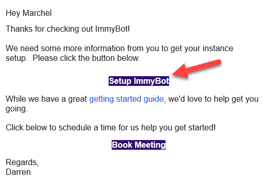


Do something else for 6 minutes. Or 9 minutes if you are in Australia. It takes longer there for some reason.

You’ll receive this email when your instance is ready:


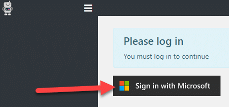

## Setup your first Computer

### Scenario 1: Adobe Reader

In this example we will tell ImmyBot that all computers you setup should get Adobe Reader.

We do this by making a [Deployment](#deployment-aka-assignment) that assigns Adobe Reader to all Workstations and Portable Devices. (Note, we use the term Portable Devices instead of laptops to be inclusive of Windows tablets. ImmyBot is not an MDM and does not support phones)

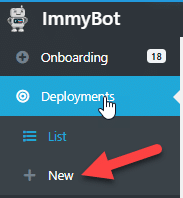

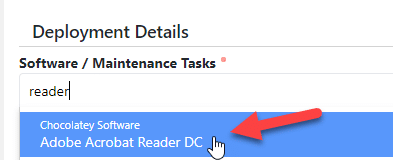

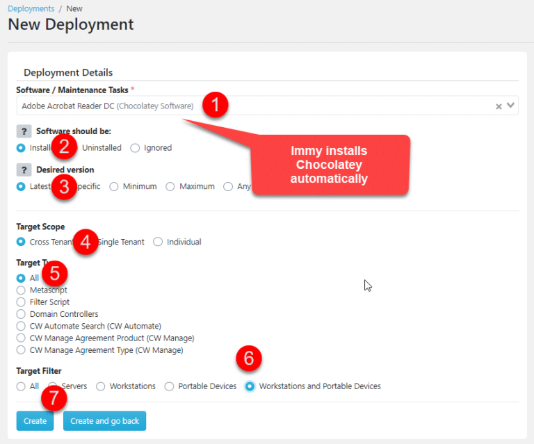

### Test with Windows Sandbox

Windows Sandbox is a fast loading disposable container in Windows that loses all settings when shutdown or restarted. It is very convenient for testing software deployments.

If you haven't used Windows Sandbox before, you can enable it by opening Windows PowerShell as Admin and running the following command:

```powershell
Enable-WindowsOptionalFeature -FeatureName "Containers-DisposableClientVM" -All -Online -NoRestart
```

### Download Windows Sandbox file (.wsb)


Wait for ImmyBot Agent to install


[Onboard](#onboarding) the Sandbox


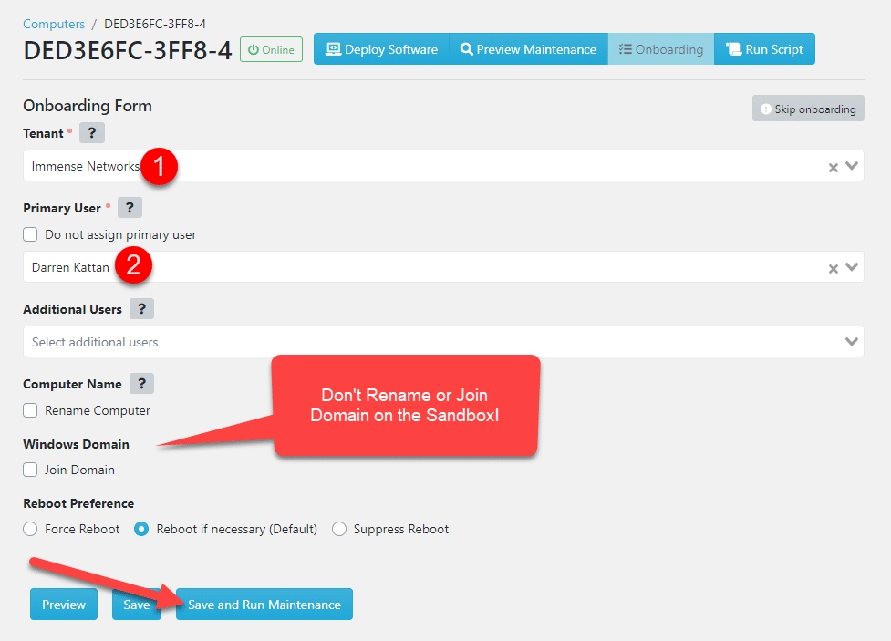


This will create a Maintenance Session that will discover that Adobe Reader *should* be installed on the machine, check if it is already installed, install Chocolatey, then use Chocolatey to install Adobe Reader.

## Adding Users

First, add a person

If you haven't consented to allow Immy to read your AzureAD, you'll need to know the users' Object ID:

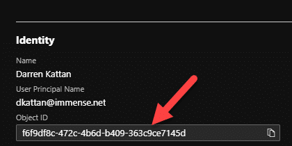

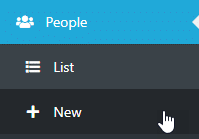

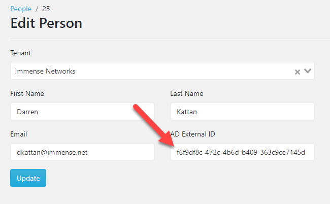

Second, Make the Person a user


(Optional) Make that User an Admin.


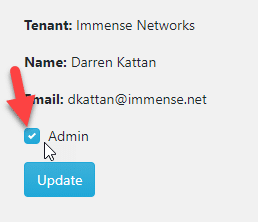

## User Roles

### MSP Admin

* Full Access, no restrictions

### MSP Non-Admin

* Cannot create/edit/delete Schedules
* Cannot create/edit/delete Users
* Cannot create/edit/delete Cross Tenant Deployments
* _Can_ create/edit/delete Single-Tenant and Individual Deployments
  * NOTE: You can disable this in Settings->Preferences with the "Allow Non-Admin Users to Manage Deployments" setting

### Customer (Tenant) Admin

* Can view/edit Computers, Schedules, Licenses and Deployments for their Tenant
* Can create users in their tenant
* Software they upload is owned by their tenant and are not visible to other tenants
* Licenses they create are owned by their tenant and are not visible to other tenants

### Customer (Tenant) Non-Admin

* Cannot create Schedules
* Cannot create Cross Tenant Deployments
* Cannot create Users
* Can create Deployments scoped to individual Computers and People


## Deployment (aka "Assignment")

**Important**
If you are just getting into ImmyBot, making Deployments is where you should start.

Note: You won't see the word "Assignment" in the user interface anywhere, but we plan to re-rename "Deployment" back to "Assignment" it in a future release.

A deployment is a rule that assigns [Software](#software) or [Maintenance Tasks](#maintenance-task) (Collectively known as "Maintenance Items") to a [Target](#target).

### Example: Adobe Reader

This is the first Deployment I make in most instances


Deployments are conceptually similar to Group Policies in that they assign settings to a group of users or computers.

IF YOU ARE JUST GETTING START WITH IMMYBOT, DO NOT BE AFRAID TO SAVE YOUR DEPLOYMENTS. THEY DO NOT APPLY AUTOMATICALLY.

If you DO want your Deployments to be applied automatically, you need to create a [Schedule](#schedules).

## Deployment Resolution

Also known as

* Creating Exceptions
* "Winning" Deployments
* Dealing with Snowflakes


Like Group Policies have a "Winning Policy", ImmyBot must have a "Winning Deployment" for a given Maintenance Item on a computer.

Let's say you have a customer "Contoso" that uses Adobe Acrobat instead of Adobe Reader, and you would like that to be installed instead.

First, create a Deployment that sets the desired state of Adobe Reader to Uninstalled for Contoso


Then, create a Deployment that Installs Adobe Acrobat for their computers


### [Target](#target)
A "[Target](#target)" is a grouping of computers (or Tenants in the case of "Cloud Tasks")

ImmyBot's ability to resolve [Targets](#target) to a group of computers is perhaps its most powerful feature.

For example, you can select a Group of users from AzureAD (which includes on-prem synced groups, and Teams) and ImmyBot will automatically resolve that to the list of computers in use by the people in that group.

If you enable PSA integration, a [Target](#target) could be all computers covered under a certain type of Agreement, or computers covered by an Agreement that includes a certain product.

This is particularly useful for security software, help desk portals, or anything else in your stack that you may only want to be installed for customers that are paying you for it.

Conversely, you could use this feature remove your stack for customers you are offboarding. Simply create an "Offboarding" product in your PSA, and create a deployment for each of the pieces of software you would like removed setting the desired state to Uninstalled for all customers with the "Offboarding" product on their agreement. Note: ImmyBot even honors the date range on additions, making scheduled offboarding easier if say the customer wants your software removed on the last day of the month.

## [Maintenance Session](#maintenance-session)

A [Maintenance Session](#maintenance-session) is conceptually similar to running gpupdate /force

In other systems, different types of maintenance happen on their own schedule. Windows Updates may run on Tuesday night, but Third Party updates may run on Wednesday night, and auto-fix tasks may run whenever an alert is fired for a failed monitor, which has its own polling interval.

By forcing all automation to happen in a sequential set of actions we call a [Maintenance Session](#maintenance-session), we can deliver predictability not only as to _what_ changes will be made, but also _when_.

This also provides a cohesive mechanism for setting up a new computer. At best in traditional RMMs you can assign Monitors that detect the absence of required software and run Install scripts when they are missing, but this doesn't scale as pre-requisites and exclusions are required.

Imagine if Group Policy could reliably deploy any type of software, and gpupdate /force worked reliably off-net, and when you ran it, it gave you real-time feedback about exactly what it was doing. Also imagine that it could optionally notify the end user before and after with a branded email telling them exactly what is being done, that optionally lets them cancel.

That's a [Maintenance Session](#maintenance-session).

You can view [Maintenance Sessions](#maintenance-session) for all computers under Computers->Sessions


Or, you can view [Maintenance Sessions](#maintenance-session) for a specific Computer under the Sessions tab for that Computer


## [Maintenance Session](#maintenance-session) Stages

### Detection Stage

During the Detection Stage, ImmyBot "Detects" which Maintenance Actions are necessary to bring the computer into compliance. These Actions are added to the [Maintenance Session](#maintenance-session).

This is a read-only process, and typically done while the user is active. This is so ImmyBot can notify the user of changes that will occur later during the Execution Stage. By doing this during the day, and scheduling Execution for later, we are giving the end user the best possible chance to be aware of the upcoming maintenance, Postponing if you allow. The Postpone feature is very popular among engineers that do may need to leave renderings and analysis tasks running overnight.

### Execution Stage


## [Maintenance Action](#maintenance-action)

```mermaid
flowchart TD
 SoftwareInstall --> Detect{Software Installed?}
 Detect --> |No| Install
 Detect --> |Yes| HasConfigurationTask{Has Configuration Task?}
 Install --> PostInstallDetect{Software Installed?}
 PostInstallDetect --> |Yes|HasConfigurationTask
 PostInstallDetect --> |No| Fail
 HasConfigurationTask --> |Yes| MaintenanceTaskTest{Run Test Script}
 MaintenanceTaskTest --> |return $true| Success
 MaintenanceTaskTest --> |return $false| RunSetScript(Run Test Script)
 RunSetScript --> PostMaintenanceTaskTest{Run Test Script}
 PostMaintenanceTaskTest --> |return $true| Success
 PostMaintenanceTaskTest --> |return $false| Fail
```

A *[Maintenance Session](#maintenance-session)* has one or more *[Maintenance Actions](#maintenance-action)*. A [Maintenance Action](#maintenance-action) could be to install software, apply a Windows Update, or run a [Maintenance Task](#maintenance-task).

The image below depicts a typical [Maintenance Session](#maintenance-session) with many [Maintenance Actions](#maintenance-action)


## Software
Software, in the context of ImmyBot refers to Software objects in My Software or Global Software.

My Software - Initially empty. When you upload your own software to ImmyBot, it goes into My Software

Global Software - Read-Only, managed by the ImmyBot team.

At the bare minimum, Software requires a [Detection Method](#detection-method).
Software can have many [Software Versions](#software-version).

```mermaid
graph TD
    C[Software] --> D[Custom Detection Script]
    C -->E[Default Uninstall Script]
    C --> F[Auto-Update Script]
```


### Pre-Requisities
This is a VERY powerful, and critically underrated feature in ImmyBot. ImmyBot resolves dependencies recursively, with built-in circular reference detection.

Common uses for Pre-Requisites include
* Ensuring a piece of software is installed before installing another
  * C++ Redistributables before 3CX Client
  * Office is installed before an Outlook Add-in
* Ensuring a piece of software is _uninstalled_ before install another
  * Removing Adobe Acrobat Reader before installing Adobe Acrobat Professional

#### Install required dependencies


#### Ordering [Maintenance Actions](#maintenance-action)


### Detection Method
A Detection Method is required in order to know whether or not a piece of Software is installed on a machine.

For Software, the detection method must returns the version of the software installed on the machine, if any.

For Maintenance Tasks, the Detection Method is the "test" mechanism, which must return true or false to indicate whether or not the machine is in compliance.

## Software Version
```mermaid
graph TD
    C[Software Version] --> Install
    C --> Uninstall
    C --> Upgrade
    C --> Repair
    C --> Test
```

## Maintenance Task
```mermaid
graph TD
    C[Maintenance Task] 
    C --> Get
    C --> Set
    C --> Test
```

or

```mermaid
graph TD
    C[Maintenance Task] 
    C --> S[Combined Script with $method parameter containing 'get','set', or 'test']    
```

### Maintenance Task Modes

#### Enforce
Runs the "test" script, if the test returns false, runs "set", then runs "test" again to verify.

#### Audit
Runs the "test" script which should return true or false. It can output whatever it wants, but the last output should be boolean.

#### Monitor
Runs the "get" script, which can return anything. Useful for collecting data like Bitlocker Keys, Quickbooks Licenses, or any other piece of information you are interested in.

## Scripts
From the above diagrams, you can see that scripts are the building blocks for higher level objects like Software and Maintenance Tasks.

### Execution Context
#### System
Run as a service on the machine

#### User
Will attempt to run as the logged on user

#### Metascript
Runs in the ImmyBot backend, and can spawn code on the system by using Invoke-ImmyCommand

#### Cloud Script
Runs in the ImmyBot backend, but intended to be run against a Tenant (perhaps for the purpose of getting or setting some setting in 365/Azure or some other system with an API). These are used exclusively in Maintenance Tasks targetting "Tenants".


## Schedules
Used to run maintenance periodically on machines. Can optionally be limited to a single Maintenance Item.

NOTE You must also have a Deployment for the Maintenance Item to set the desired state. Imagine a scenario where you need to ensure a single piece of software is up-to-date on all computers except for a CNC machine. Create 2 deployments, the first setting the desired state to Installed->Latest for all computers, then a second stating that the desired state is Ignored for the CNC machine. When you create the schedule, the software will be ignored for the CNC machine.

## RMM Links

To ImmyBot an RMM is a system that provides a list of computers, and a mechanism to run PowerShell scripts on them.


To avoid having to deploy the ImmyAgent to existing machines, ImmyBot optionally integrates with RMMs like ConnectWise Automate and ConnectWise Control and uses their agents instead. These systems are not as performant as the ImmyAgent, but can suppliment ImmyBot functionality.

For example, if you add an RMM Link for ConnectWise Control, you can open a remote session to the computer directly within ImmyBot:


If you add an RMM Link for ConnectWise Automate, Scheduled [Maintenance Sessions](#maintenance-session) will apply all Approved Windows Updates using the ConnectWise Automate API based on your Approval Policies in Automate Patch Manager.

You can even add multiple RMMs of the same type, which is often useful in merger and acquisition scenarios. You may choose to use ImmyBot as your single pane of glass to manage both, or simply let ImmyBot be a neutral third party for facilitating the consolidation of RMM agents to the parent company's RMM.

## Identification

Because the same computer often exists in multiple RMMs (Like how CW Automate typically installs CW Control Automatically), ImmyBot prevents duplicates by identifying the computer by a unique id. We DO NOT use MAC Address! This unique id persists even if you wipe and reload the machine.

When a new machine is detected, it first goes to New Computers->Actively Identifying


It uses the following script to collect the UUID from the machine:
```
gwmi Win32_ComputerSystemProduct | select -expand UUID
```

This value is static even if you wipe and reload the machine. We chose this value instead of Mac Address or Hard Drive serial number because of issues other systems have with USB Ethernet cables and hard drive replacement. We did not use serialnumber because we learned that many computers do not have serial numbers.

In practice, this value works almost _too_ well. Machines you just wiped and expect to find in New Computers, are often associated to their pre-wiped computer objects. To find them, you often have to search for the serial number of the computer in the Computer List. In 0.40.1 we began using the Windows OfflineInstallationID value to identify when an existing computer has been wiped so we can set its status to "Needs Onboarding" which causes it to show up under New Computers as expected.

If it is a machine ImmyBot has seen before, it will be associated to the existing Computer, and you will find a new entry under the Computer's Agents tab. Under the hood we call these entries "RmmComputers".

Computers can have one or more RmmComputers(Agents). You can think of these as logical "pathways" to the computer. We only need one to be online to function.


### Identification Failures

#### Needs a Manual Decision
Often when an RMM Agent gets re-installed, it will get a new id in the RMM (ComputerId in Automate, SessionID in Control). ImmyBot will recognize that it is the same computer, but due to the fact that virtualization technologies and hard drive cloning can lead to the same scenario, we require you to tell us whether we should overwrite the existing RmmComputer, or keep both. 99% of the time you will click "Overwrite Existing". If the machine was in fact cloned, you would click Keep Both, in which case Immy shims the duplicate UUID with its own to prevent collisions.

#### Failed

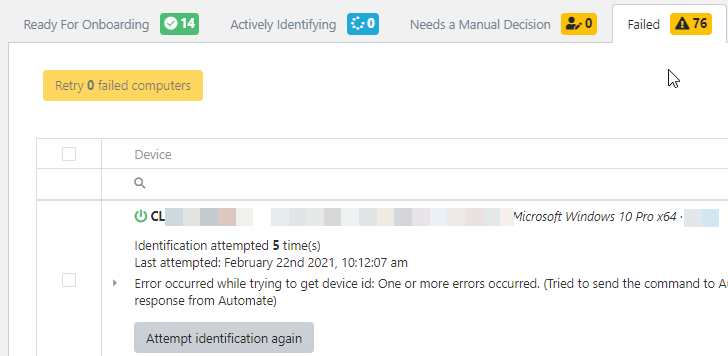

The most common causes of identification failure are an overloaded or unresponsive RMM, or the machine has broken WMI, preventing us from retrieving the uniqueid of the machine. You may retry identification on one or all of the failed computers once these conditions are resolved.

# Onboarding

In ImmyBot, Onboarding is the first [Maintenance Session](#maintenance-session) run against a machine. You may enable or disable Onboarding for a given Tenant or entirely under Settings->Preferences. When disabled, computers do not get put into New Computers, and go directly into the Computer list. This is useful if you have a customer that sets up their own computers outside of ImmyBot, as it prevents their machines from clogging up the New Computers area.

## Tenants

These are your Customers. We recommend syncing Tenants from CW Automate or Azure.

## User Computer Affinity
ImmyBot periodically runs whoami /upn on all computers and keeps a rolling list of the last 10 UPNs. It assigns the Primary User of the computer to the "Person" (Synced from Azure) with the matching UPN.

For environments without AzureAD, ImmyBot will lookup the UPN of the Person from a Domain Controller in the computer's Tenant
